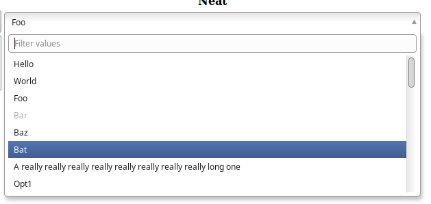
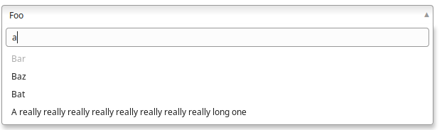
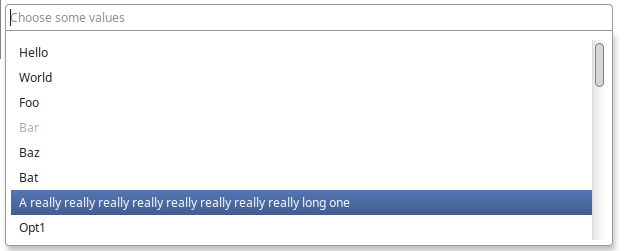
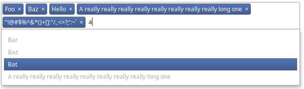

# neat-select
This turns those super-useful and modern native `<select>` dropdown
controls into something more useful and more modern.

It is mostly a ripoff of [Chosen](https://github.com/harvesthq/chosen)
to be simpler, less full of features, and not have a dependency on jQuery.
Basically, it's smaller and contains more spaghetti.

And like every other JavaScript library that's ever been written, it's
"lightweight": 6.9K minified/2.7K gzipped

How neat is that?

## Usage
To use it, reference the CSS and JavaScript file. Then, transform
your boring existing `<select>` controls into something that's pretty neat:

```javascript
neatSelect({
  selectElement: document.querySelector('select')
});
```

Supports disabled `<option>`s and the `multiple` attribute. Does not
yet support `<optgroup>` because I don't need that and I don't think
anyone really uses those anyway, right?

Supports filtering/searching and keyboard navigation.

I've tested it on all browsers excluding the ones that aren't Firefox
or Chrome.

## Gratuitous screenshots

### Single select




### Multiple select




## API
Calling `neatSelect` returns an object:

```javascript
{
	// refreshes the list of options/selected values against the original
	// select. useful if you dynamically update the options. this will also
	// rebuild a previously destroyed neat select control.
	update: function() {},
	
	// reverts to the original select, makes everything less neat.
	destroy: function() {},
	
	// returns an array of selected options. this is really a convenience
	// function, you can always do originalSelectElement.value just like
	// normal. neat-select will update the original select/options in the
	// course of normal interaction.
	getValues: function() {},
	
	// opens the dropdown
	open: function() {},
	
	// closes the dropdown
	close: function() {}
}
```

If you don't want to keep track of this object, you can call 
`neatSelect` with an ID (value of `data-neat-select` on the original
`<select>` element) or the original `<select>` element and the API
object will be returned.

### Options
```javascript
neatSelect({
	// required, the <select> element to make neater
	selectElement: HTMLElement,
	
	// placeholder for the search/filter text input
	inputPlaceholder: String,
	
	// whether to enable search/filtering for single selects
	search: Boolean,
});

// OR

// the internal neat-select ID (value of data-neat-select on
// original <select> or .neat-select container div
neatSelect(Number);
```


